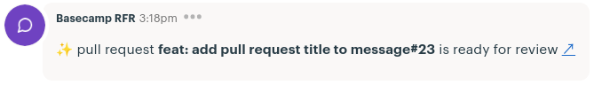

<div align="center">

# Basecamp Pull Request Ready for Review Notifier


### Use basecamp chatbots to notify when a PR are ready to review


</div>


## Setup

* Create a chatbot on your basecamp follows this [article](https://3.basecamp-help.com/article/160-chatbots-and-webhooks)

* Add your chatbot key to github secret. Click on <kbd>Settings</kbd> > <kbd>Secrets</kbd>

* Create `.github/workflows/main.yml` file and follows the usage below

## Basic Usage

```yaml
on:
   pull_request:
      types: [ready_for_review]
name: Basecamp RfR Notify
jobs:
   notifyBasecamp:
      name: Notify Basecamp
      runs-on: ubuntu-latest
      steps:
      - uses: actions/checkout@v2
      - name: Notify Basecamp
        uses: pmqueiroz/basecamp-ready-for-review@v2
        env:
           BASECAMP_CHATBOT_SECRET: ${{ secrets.BASECAMP_CHATBOT_KEY }}
        with:
           # https://3.basecampapi.com/ACCOUNT_ID/integrations/BASECAMP_CHATBOT_SECRET/buckets/BUCKET_ID/chats/CHAT_ID/lines.json
           account_id: "7777777"
           bucket_id: "7777777"
           chat_id: "7777777"
```
## Notify PR Opened

```yaml
on:
   pull_request:
      types: [ready_for_review, opened]
name: Basecamp RfR Notify
jobs:
   notifyBasecamp:
      name: Notify Basecamp
      runs-on: ubuntu-latest
      steps:
      - uses: actions/checkout@v2
      - name: Notify Basecamp
        uses: pmqueiroz/basecamp-ready-for-review@v2
        env:
           BASECAMP_CHATBOT_SECRET: ${{ secrets.BASECAMP_CHATBOT_KEY }}
        with:
           # https://3.basecampapi.com/ACCOUNT_ID/integrations/BASECAMP_CHATBOT_SECRET/buckets/BUCKET_ID/chats/CHAT_ID/lines.json
           account_id: "7777777"
           bucket_id: "7777777"
           chat_id: "7777777"
           notify_open: true # default: false
           notify_open_when_draft: false # default: false
```

## Other Features

### Templates *(non-released features)*

You can change the messages templates with the syntax below:

```yaml
with:
custom_template: |
   OPENED:PREFIX=💥
   READY_FOR_REVIEW:MESSAGE=<p>${prefix} #${pr_number} is ready for review</p>
```

| Variable                 | Default                            |
| ------------------------ | ---------------------------------- |
| READY_FOR_REVIEW:PREFIX  | `✨`                               |
| READY_FOR_REVIEW:MESSAGE | `$DEFAULT_MESSAGE_READY_TO_REVIEW` |
| OPENED:PREFIX            | `🚀`                               |
| OPENED:MESSAGE           | `$DEFAULT_PR_ACTIONS`              |
| MERGED:PREFIX            | `🎈`                               |
| MERGED:MESSAGE           | `$DEFAULT_PR_ACTIONS`              |
| CLOSED:PREFIX            | `❌`                               |
| CLOSED:MESSAGE           | `$DEFAULT_PR_ACTIONS`              |

DEFAULT_MESSAGE_READY_TO_REVIEW = `<p>${prefix} pull request <b>${pr_title}#${pr_number}</b> is ${action} <a href="${html_url}">↗</a></p>`

DEFAULT_PR_ACTIONS = `<p>${prefix} ${pr_author} ${action} pull request <b>${pr_title}#${pr_number}</b> <a href="${html_url}">↗</a></p>`

#### Available message variables

| Variables |
| --------- |
| pr_title  |
| pr_number |
| html_url  |
| pr_author |
| action    |
| prefix    | 

## Features Todo

- [ ] Notify when someone merge a pull request

- [x] Custom template messages

- [ ] Change emoji per label detected